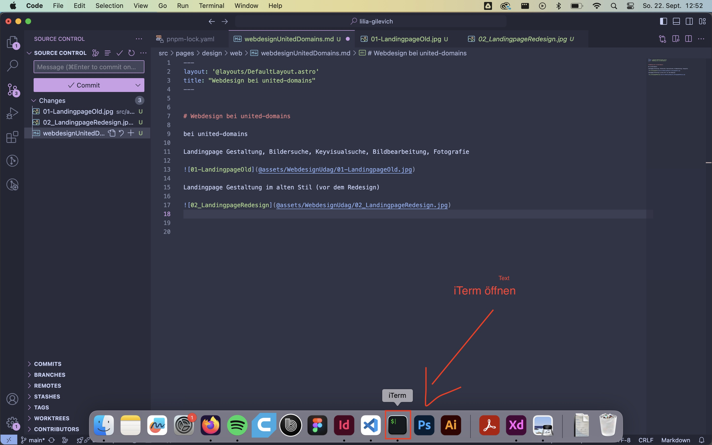
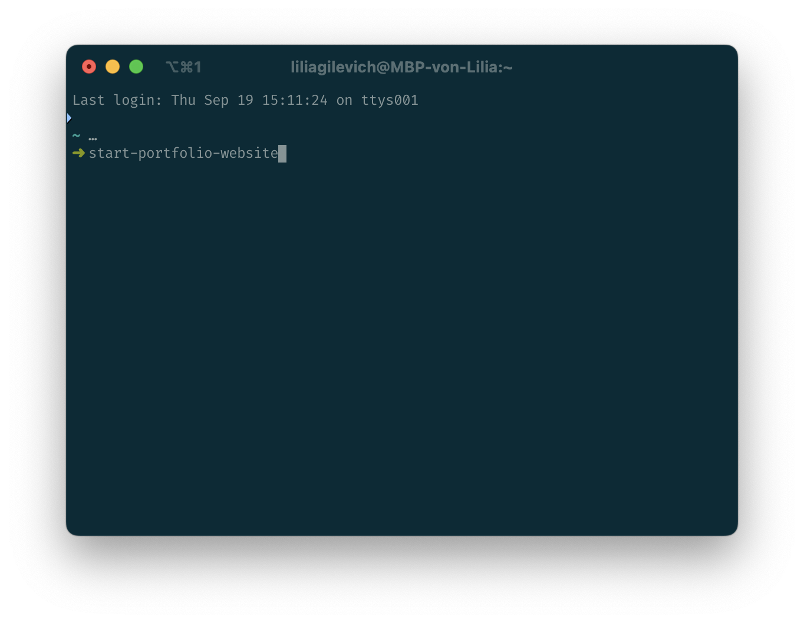
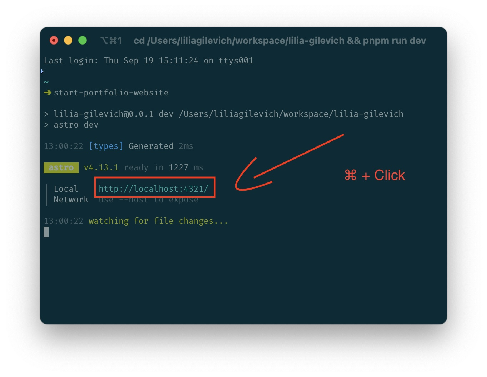
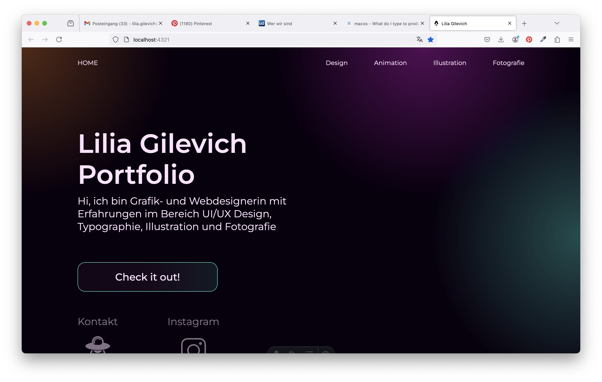
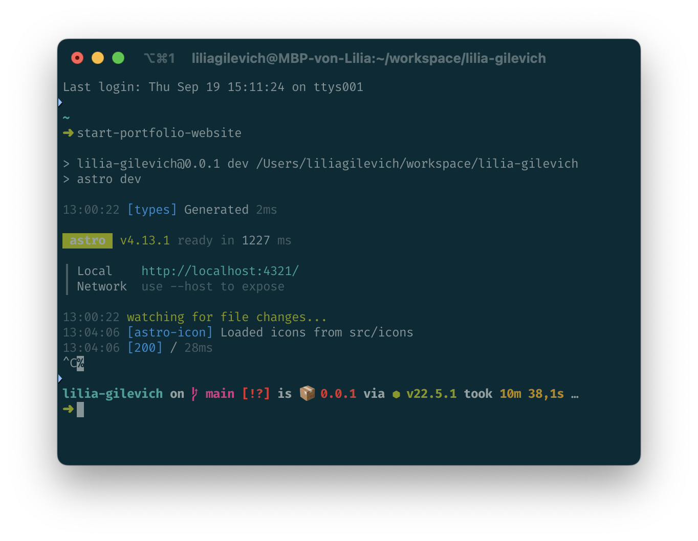

# Lilias Homepage
## Todo list
### components
- [X] introduce the button component
- [X] introduce a icon plus text component
- [X] set the link styling correctly
- [X] overview buttons
- [X] design kategorien button (what's the difference to the overview button?)
- [X] design kategorien component
- [ ] project list
- [ ] breadcrumbs

### pages
- [ ] kontakt
- [X] overview
- [X] design (overview)
- [X] Webdesign

### styling
- [ ] image styling (responsibru)
- [ ] zeilenabstända
- [ ] Links im Text hervorheben (youtube)
- [ ] Halloween Screens Images evtl nicht auf weiß sondern einzeln
- [ ] Halloween Konzept Content reduzieren, vorallem Bilder mit Text

## How to
### Start the website
1. open iterm


2. start portfolio website by entering the following command and pressing `ENTER`
```shell
start-portfolio-website
```



3. `⌘ + click` the link of the output of the command


4. and now the website should be open


DON'T FORGET: to stop the website once you are finished

5. stop the website by pressing `⌃ + C` (control + C) in iTerm

after that, you can savely close iTerm


### How to change the content of a page
#### Context
The pages that you can change are "Markdown" files, they end with `.md`. Additionally, the url that you can see in the browser matches the directory structure you can find under `src/pages`.
#### Instructions
1. Decide on what page you want to change by browsing through your homepage under https://localhost:4321
2. look closely are the URL, everything after `https://localhost:4321...` describes the location of the file you want to edit
3. on the left side you see multiple menu icons, the 1st has a file icon, click it
4. now you should be able to find the file you are looking for under `src/pages<your file path and name>.md`
5. double click on the file and it will open
6. after changing the content, save the file with CMD + S and you should immediately see the changes on the web page

### Commit & Push
1. on the left side you see multiple menu icons, click the 3rd one
2. add a message in the "Message" field
3. ensure the blue button shows "Commit & Push" 
    - if so you can click it
    - if not, click the dropdown at the right and and select "Commit & Push"

